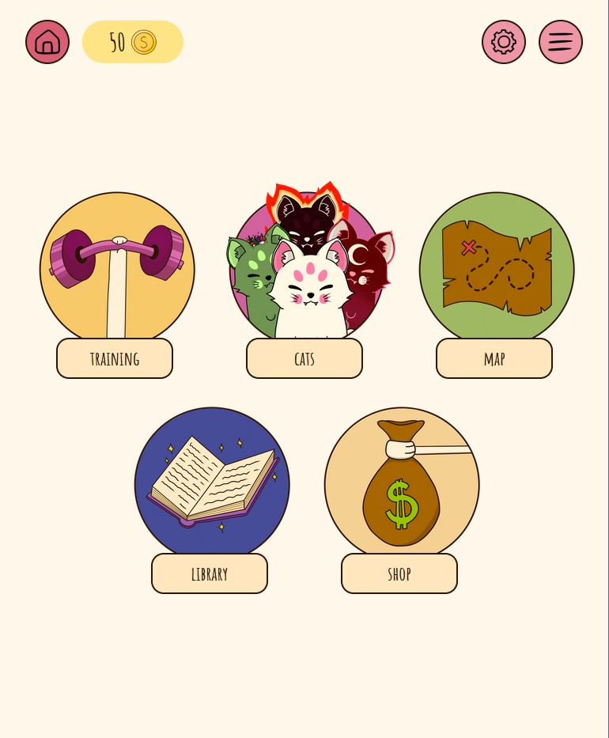
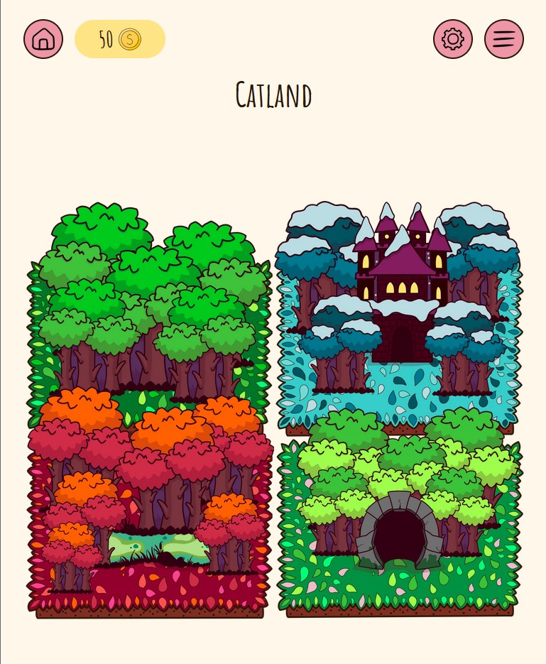
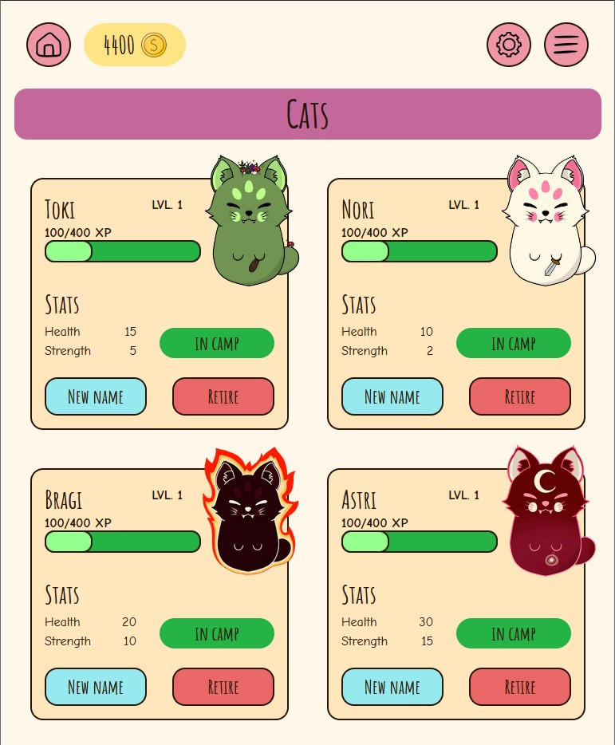

# Cattown


### Graphics & Design

@ [Jennifer McAllister](https://github.com/jennifer-mcallister)

## Project idea summary

Create an online browser game where the goal is to collect four unique items to build a shield to protect your town. To reach the goal you need to buy and train your cats and send them out on missions to explore, scavenge or defeat the boss who guards one of the four unique items. To succeed with a mission you need to improve the stats on your cats by training them or sending them out on missions to earn XP that will raise their level and thereby their stats and chance of succeeding more difficult missions. Another way to improve stats is by buying or finding relics which will improve your overall stats.

## Purpose

I have been playing video games since a very young age and I have always dreamt of creating my own game but never thought that would be possible. Until we had our Javascript course and we created a Tic Tac Toe game in Vue. Since then my goal has been to create a game as my Degree Project. I thought that would be something I could be proud of and at the same time a good way to showcase everything that I have learned so far throughout my time at Medieinstitutet.

This game will bring a fun experience for those who don’t have time or energy to play games for a long time every day but also for those who don’t have the budget to buy games. This game will be ad free so that the user can enjoy a free game without distractions.

## Techstack

### Frontend

- Typescript
- React
- Styled components

### Database

- Firebase - realtime database

### Tests

- Usertests (interviews)
- Accessibility (Lighthouse)

## User interface preview





## Installation

### Requirements

Node.js and npm installed

### Clone repository

```
git clone https://github.com/jennifer-mcallister/Cattown.git
```

### Install dependencies

```
npm install
```

### Set up environment variables

Create a .env file in the root of your project with the following content:

```
VITE_API_KEY = firebase_api_key

VITE_AUTH_DOMAIN = firebase_auth_domain

VITE_DATABASE_URL = firebase_database_url

VITE_PROJECT_ID = firebase_project_id

VITE_STORAGE_BUCKET = firebase_storage_bucket

VITE_MESS_SEND_ID = firebase_send_id

VITE_APP_ID = firebase_app_id
```

### Run project in development

```
npm run dev
```

### Build project

```
npm run build
```

## Commit messages convention

| Type          | Short  | Description                                              |
| ------------- | ------ | -------------------------------------------------------- |
| build         | build  | changes that affect the build or dependencies            |
| feature       | feat   | new feature                                              |
| bug fix       | fix    | bug fix                                                  |
| documentation | docs   | changes or adds to documentation                         |
| refactor      | ref    | code changes that neither fix a bug nor adds a feature   |
| reverts       | revert | revert to previous commit                                |
| clean         | clean  | clean code of, for example, comments or unnecessary code |
